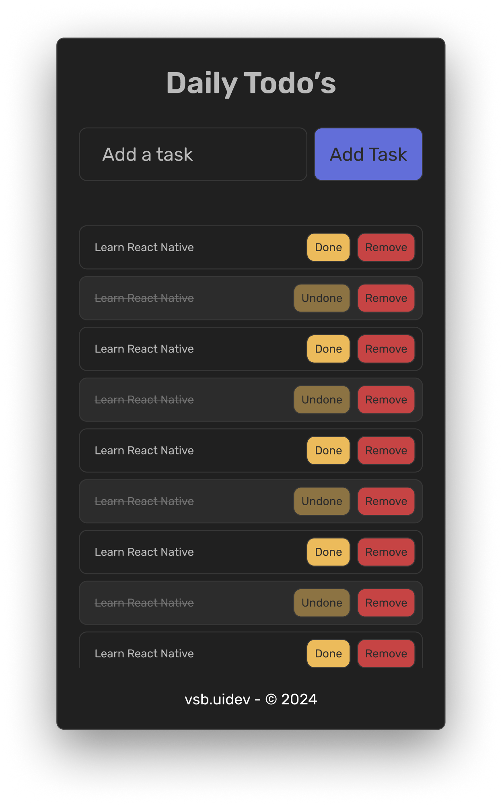
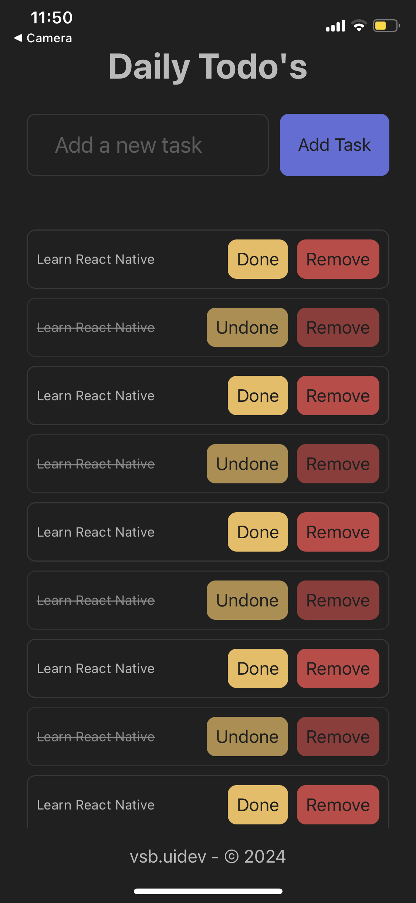

# Minimal To-do List App - React Native :

## Preview

<p align="center">
   Figma Design Preview:
  
</p>
<br />
<p align="center">
   Mobile Screenshot Preview:
  
</p>
<!-- - [Mobile Screenshot](./Preview/Screenshot.PNG) -->

## Figma Design

Explore the app's user interface design on Figma: [Figma Design Link](https://www.figma.com/community/file/1350344600031523800/minimal-to-do-list-app)

## Introduction

Welcome to the React Native Minimal To-do List app! This mobile application allows you to manage your tasks on-the-go with ease. Whether you're organizing your daily to-do's or planning your next big project, this app has you covered.

## Features

- **Task Management:** Add, edit, and remove tasks effortlessly.
- **Checklist:** Mark tasks as completed with a single tap.
- **Interface:** Sleek and user-friendly design for seamless navigation.

## Installation

1. Clone the repository:

```bash
git clone https://github.com/vsbuidev/react-native-todo-list.git
cd react-native-todo-list
```

2. Install dependencies:

```bash
npm install
```

3. Run the app on a simulator or device:

```bash
npm start
```

4. Install the Expo App (Android/iOS) from the Google Play / App Store and Scan the QR code shown in terminal with Expo Go (Android) or the Camera app (iOS).

## Contributing

Contributions are welcome! If you find any issues or have suggestions for improvements, please open an issue or submit a pull request.

## License

This project is licensed under the [MIT License](LICENSE).

## Acknowledgments

- Special thanks to the [React Native](https://reactnative.dev/) and [Expo](https://expo.dev/) community for their invaluable resources and support.
